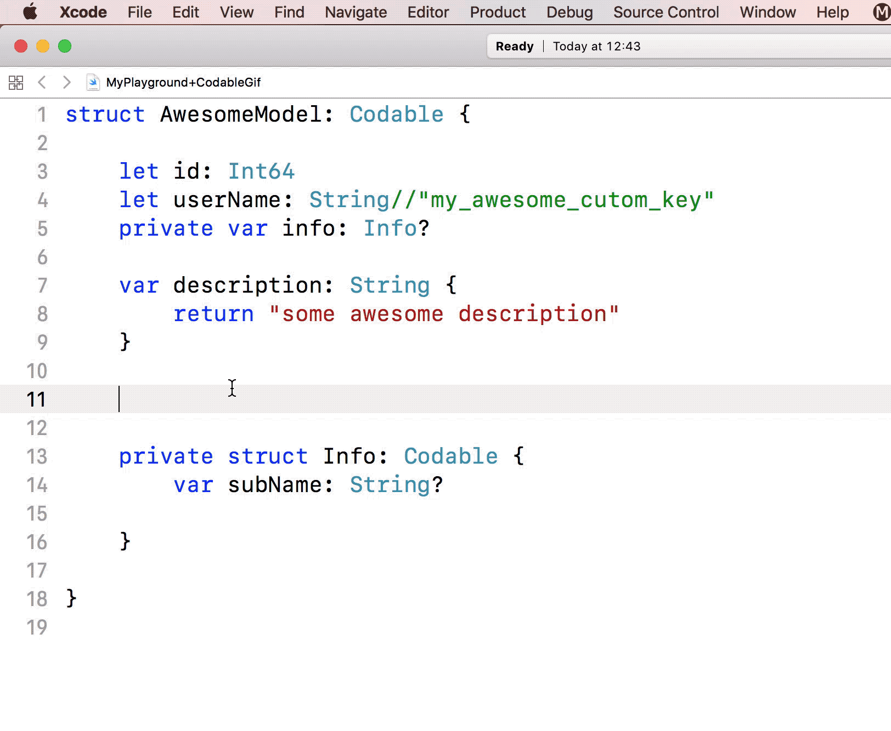

# TrickerX
An Xcode9+ Extension which make [CodingKeys](https://developer.apple.com/documentation/foundation/archives_and_serialization/encoding_and_decoding_custom_types) automatically.



## How to use
1. Download the installation [package](https://github.com/wleii/TrickerX/tree/master/app) I provide, or you can download project and build it yourself.
2. Open the App you have installed 
3. Launch Xcode -> Open `Make CodingKey` File -> Editor -> Codable -> Make CodingKeys （PS: If you need, you can bind the shortcut key for this :]

## More specific methods of use
TrickerX also support the following way to define keys, e.g.
```swift
struct CustomKey: Codable {
    // TrickerX will parsing the syntax //my_custom_key 
    private let key: String //my_custom_key
}
```
result
```swift
struct CustomKey: Codable {
    // TrickerX will parsing the syntax //my_custom_key 
    private let key: String 

    enum CodingKeys: String, Codable {
        case key = "my_custom_key"
    }
}
```

## License
MIT
